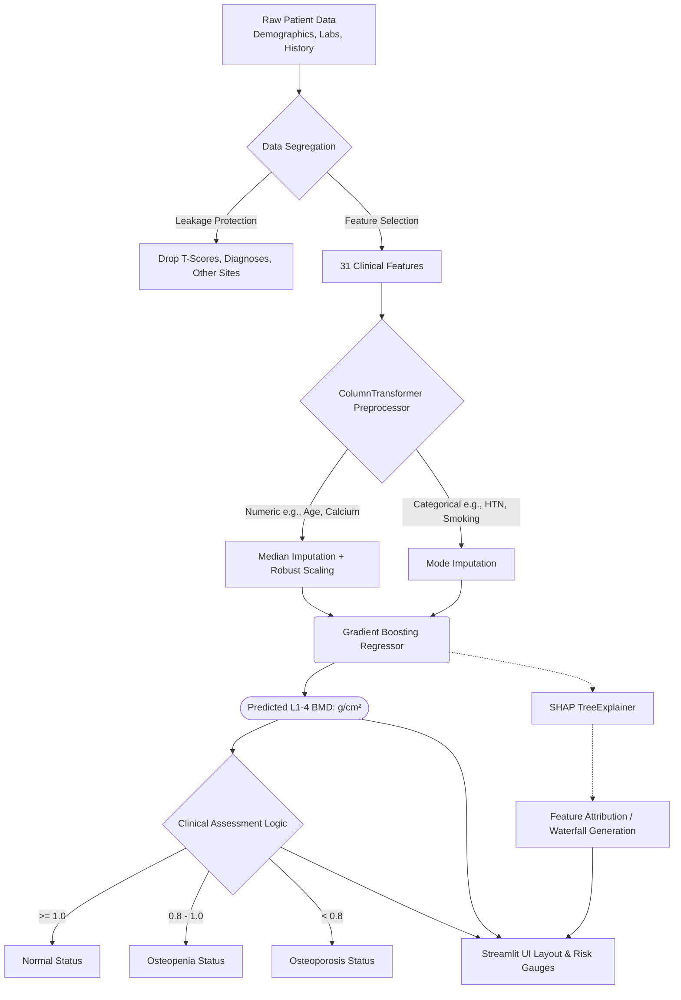

# OsteoScan: BMD Clinical Prediction Pipeline

## 1. Methodology

The OsteoScan project utilizes Machine Learning to predict lumbar spine Bone Mineral Density (BMD) at tracking points L1-4 directly from routine clinical data. This acts as a pre-screening tool to identify high-risk patients who would benefit most from an immediate Dual-energy X-ray Absorptiometry (DXA) scan.

### Data Processing Pipeline
1. **Data Ingestion & Cleaning**: Intake of raw patient data containing demographics, biochemical markers, comorbidities, and medication history. Rows with missing target values (L1-4 BMD) are dropped to ensure clean data for training.
2. **Data Leakage Prevention**: T-scores and other tracking sites (`L1.4T`, `FN`, `FNT`, `TL`, `TLT`, `OP`, `Fracture`) are rigorously excluded from training to prevent model leakage, simulating a purely predictive real-world medical environment from standard check-up inputs only.
3. **Preprocessing (`sklearn.compose.ColumnTransformer`)**: 
   - *Numeric Features (Age, Height, BMI, ALT, AST, etc.)*: Automatically imputed utilizing a `SimpleImputer` (median strategy) and scaled dynamically using a `RobustScaler` to handle clinical outliers without skewing distributions.
   - *Binary Features (Comorbidities, Lifestyle flags)*: Imputed using a `SimpleImputer` (most frequent strategy).
4. **Model Selection & Tuning**: The preprocessed features are passed into a `GradientBoostingRegressor`. Hyperparameters (`n_estimators`, `max_depth`, `learning_rate`, `min_samples_split`) are optimized using an exhaustive search via `GridSearchCV` combined with 3-fold cross-validation.
5. **Evaluation**: Evaluated on an independent, held-out 20% test set utilizing R² score, Mean Absolute Error (MAE), and Root Mean Square Error (RMSE), followed by a 5-fold cross-validation layer over the training set to ensure generalized stability and score distribution. 
6. **Explainability**: A SHAP (SHapley Additive exPlanations) `TreeExplainer` maps output predictions back to input features to generate waterfall plots, providing feature-level transparent clinical interpretations for doctors and patients.

---

## 2. Formulas and Calculations

Unlike conventional regression modeling which explicitly exposes coefficients to determine value, the primary predictor—Gradient Boosting Regressor—creates an ensemble of iterative decision trees to calculate its end L1-4 BMD value (in g/cm²). 
However, several foundational formulas and heuristics are applied within the system to classify and describe the output.

### Dashboard Risk Score Mapping (Percentage Value)
To create an intuitive visual gauge across the frontend dashboard, the raw continuous BMD prediction is mapped to a percentage scale mapped linearly against a clinical absolute reference range of `0.3` to `1.6`:

`BMD Score (%) = [ (Predicted BMD - 0.3) / (1.6 - 0.3) ] × 100`

> **Note**: This normalizes a typical biological metric variation (e.g. 0.812) into a 0-100 gauge format for user-friendly interaction visualization.

### Clinical Classification Thresholds
The continuous g/cm² output is segmented diagnostically based on approximate lumbar L1-4 values:
* **Normal**: Predicted BMD $\ge$ 1.000 g/cm²
* **Osteopenia**: 0.800 g/cm² $\le$ Predicted BMD < 1.000 g/cm²
* **Osteoporosis**: Predicted BMD < 0.800 g/cm²

### Standard DXA Clinical Formulas (For Domain Reference)
While not directly computed by the model, when verified organically via a hardware DXA scanner, BMD correlates deeply with:
1. **Absolute BMD**: `BMD (g/cm²) = BMC (Bone Mineral Content) / Area (cm²)`
2. **T-Score (Standardized Diagnosis Basis Variant)**: `T-Score = (Measured BMD - Young Adult Mean BMD) / Young Adult Population Standard Deviation`
3. **BMI Computation Feature**: `BMI (kg/m²) = Weight(kg) / [Height(cm) / 100]²`

---

## 3. System Block Diagram

---

## 4. Full Parameter List (Clinical Features)

The model utilizes 31 distinct clinical features (parameters) collected during standard patient assessments. Below is the complete list with their full medical or clinical forms:

### Demographics & Anthropometrics (4)
1. **Age**: Age
2. **Height**: Height
3. **Weight**: Weight
4. **BMI**: Body Mass Index

### Biochemical Markers (11)
5. **ALT**: Alanine Aminotransferase (Liver function)
6. **AST**: Aspartate Aminotransferase (Liver function)
7. **BUN**: Blood Urea Nitrogen (Kidney function)
8. **CREA**: Creatinine (Kidney function)
9. **URIC**: Uric Acid (Purine metabolism)
10. **FBG**: Fasting Blood Glucose 
11. **HDL-C**: High-Density Lipoprotein Cholesterol 
12. **LDL-C**: Low-Density Lipoprotein Cholesterol
13. **Ca**: Serum Calcium
14. **P**: Serum Phosphorus
15. **Mg**: Serum Magnesium

### Medications & Supplements (4)
16. **Calsium**: Calcium Supplementation (noted as 'Calsium' in the source dataset)
17. **Calcitriol**: Calcitriol Supplementation (Active form of Vitamin D)
18. **Bisphosphonate**: Bisphosphonate Therapy (Bone resorption inhibitors)
19. **Calcitonin**: Calcitonin Therapy

### Comorbidities (10)
20. **HTN**: Hypertension (High Blood Pressure)
21. **COPD**: Chronic Obstructive Pulmonary Disease
22. **DM**: Diabetes Mellitus
23. **Hyperlipidaemia**: Hyperlipidemia (High Cholesterol/Triglycerides)
24. **Hyperuricemia**: Hyperuricemia (Excess uric acid)
25. **AS**: Ankylosing Spondylitis
26. **VT**: Venous Thrombosis / Vertebral Trauma
27. **VD**: Vascular Disease / Vitamin D Deficiency
28. **CAD**: Coronary Artery Disease
29. **CKD**: Chronic Kidney Disease

### Lifestyle Factors (2)
30. **Smoking**: Smoking Status
31. **Drinking**: Alcohol Consumption Status
